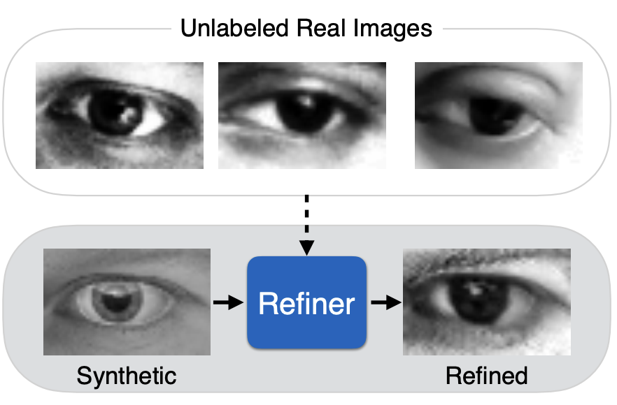

# SimGAN

Implementation of [Learning from Simulated and Unsupervised Images through Adversarial Training](https://arxiv.org/pdf/1612.07828v1) (Apple, 2016) using TensorFlow 2.

SimGAN is a method introduced by Apple researchers in 2016 to improve synthetic (computer-generated) images using real, unlabeled data. It uses GAN with some twists, Generator (termed as Refiner in paper) takes synthetic images as input and refines them to look more realistic, Discriminator distinguishes between real images and refined synthetic images. Authors proposed a new loss termed "self-regularization loss" which is used to retain "annotations" from synthetic images to its refined version.



## Getting Started

1. Install required python packages

```
pip install -r requirements.txt
```

2. Dataset

You can find the dataset from Kaggle [here](https://www.kaggle.com/datasets/4quant/eye-gaze). Both real (MPIIGaze) and Simulated (UnityEyes) can be found there in ready to go h5 format. ( `real_gaze.h5` and `gaze.h5` )

3. Training

To start training, run the following script:

```
python simgan.py <real_h5_file> <simulated_h5_file> [--refiner_model <REF_MODEL_PATH>] [--discriminator_model <DISC_MODEL_PATH>]
```

**Args**:
- `<real_h5_file>` - Path to the real dataset in h5 format (`real_gaze.h5`).
- `<synthetic_h5_file>` - Path to the synthetic dataset in h5 format (`gaze.h5`)
- `<REF_MODEL_PATH>` - (Optional) Refiner model to start training from.
- `<DISC_MODEL_PATH>` - (Optional) Discriminator model to start training from.